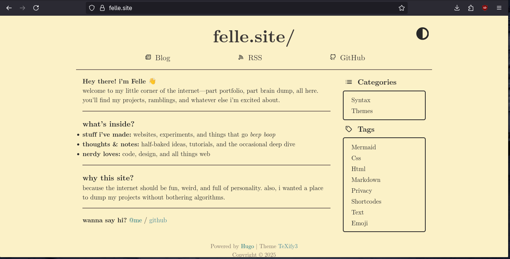

# felle.site

My personal website, built with [Hugo](https://gohugo.io/). It’s where I put my projects, thoughts, and whatever else I feel like sharing. Think of it as my digital scrapbook, but with more code and fewer stickers.

## Screenshot

## Setup

If you want to run this locally:

1. Clone the repo.
2. Run `hugo server -D`.
3. Open [http://localhost:1313](http://localhost:1313).

## License

GPL-3.0. Do what you want, just keep it open.

**Live site:** [felle.site](https://felle.site)
